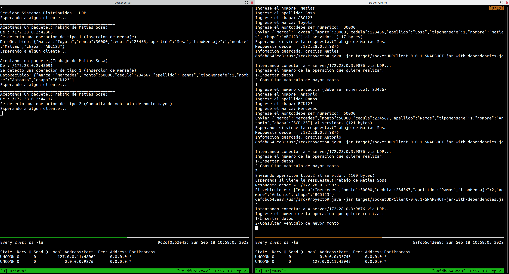

# Primer parcial - parte práctica
Escriba un programa servidor UDP y un programa cliente UDP en lenguaje Java que ofrezca las siguientes funcionalidades:

* Tipo de operación 1: Recibir datos de personas y vehículos (cédula, nombre, apellido, chapa, marca, monto) y almacenar en memoria.
* Tipo de operación 2: Consulta de vehículo de monto mayor.
## Consideraciones:
* Debe crear también el programa cliente UDP para realizar pruebas.
* Los datos lo puede almacenar simplemente en memoria (list, array, etc).

**Debe realizarlo en su maquina personal y enviar uno o varios push al repositorio personal del alumno en un proyecto git que tengan creado o creando uno nuevo.**

**Debe especificar un README.md donde indique las clases Java que creó o modificó para que el profesor realice la corrección.**

- Debe incluir capturas de pantalla donde se imprima vía system.out/logger de su nombre y apellido en la consola del cliente.
- Debe incluir captura de pantalla del tipo de operación 2.

## Descripcion de la entrega
El proyecto cuenta con una imagen de docker compose especificada dentro de un archivo [yml](docker-compose.yml), cuenta con 2 nodos, uno es cliente y otro servidor.


La siguiente imagen muestra los procesos solicitados por el problema



Los todos los metodos fueron modificados por el alumno

## Instrucciones para levantar la imagen
Ubicarse en la raiz del repositorio donde se encuentra el docker compose

Ejecutar la siguiente linea de comando
```console
docker compose up --build
```
Esta comando construye la imagen y luego levanta el contenedor

Luego en una terminal abrimos la instancia cliente
```console
sudo docker exec -it examen-client-1 sh
```
Y en otra terminal abrimos la instancia servidor
```console
sudo docker exec -it examen-servidor-1 sh
```
Levantamos los jar del servidor y del cliente en sus respectivas terminales
```console
java -jar target/socketUDPServer-0.0.1-SNAPSHOT-jar-with-dependencies.jar
```
```console
java -jar target/socketUDPClient-0.0.1-SNAPSHOT-jar-with-dependencies.jar
```
